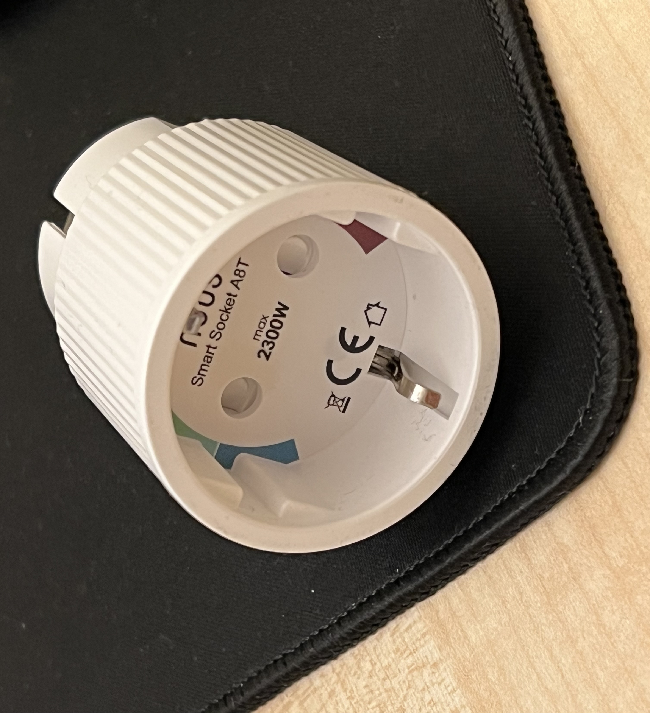

# TasmotaOSC
OSC talker/listener by Berry on a Tasmota device

This Berry code copied to the Berry console enables receiving/sending OSC messages on a Tasmota device.
Inspired, started and developed from a conversation at https://github.com/arendst/Tasmota/discussions/24202 with @Staars

Just download OSC_sendandreceive.be, edit the config to your needs, copy&paste to the Berry console and run!

Tested on a NOUS A8T WiFi Plug, tasmota32, 13.2.0 and 15.2.0 with console ttols, Protokol and Gig Performer (gig attached...)-

TODO:
The first try to make this permanent showed up some differnt behaviour with running from the file system, and freeing the console(s). 
Need some more background information and time to test...
