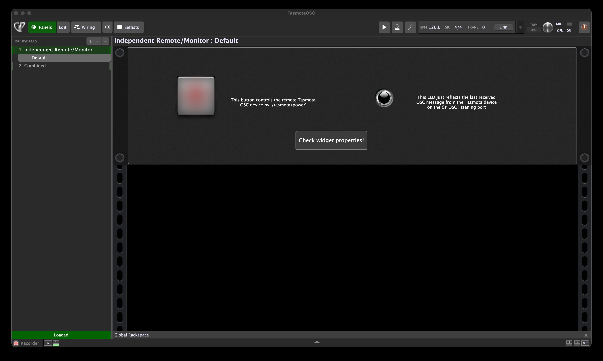
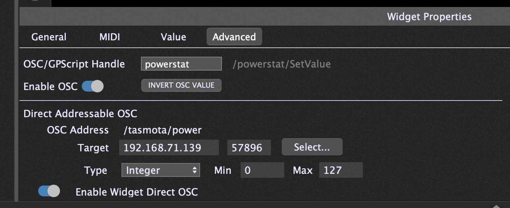

# TasmotaOSC
OSC talker/listener by Berry on a Tasmota devices

This Berry code snippets copied to the Berry console enables receiving/sending OSC messages on a Tasmota device.
Inspired, started and developed from a conversation at https://github.com/arendst/Tasmota/discussions/24202 with @Staars

Tested on a NOUS A8T WiFi Plug, tasmota32 v15.2.0 with console tools (oscsend...), Protokol and Gig Performer (THE VST plugin host for live music).

## Berry Console code snippet for testing

Just download `OSC_sendandreceive.be`, edit the config to your needs, copy&paste to the Berry console and run!

## Permanent operation

Add the code from `autoexec.be` to your `autoexec.be` on your Tasmota device (or just upload it) within the Tasmota file manager.
Also upload the files `osc_transmitter.be`and `osc_receiver.be` to your device. Modify the before uploading or inside the Tasmota file manager:

The code snippets should be self-explaining ;-)

Reboot after uploading/modifiying and check the console log.

If you want to test with GigPerformer use the attached `TasmotaOSC.gig`. Check the Widget propeerties and modyfy to your needs.

Also check you global GP listening port... 

Have fun!
